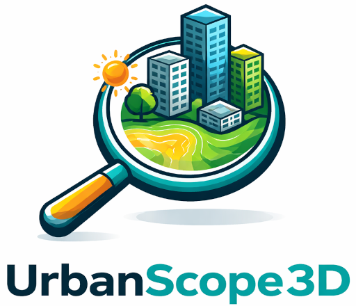

# UrbanScope3D

UrbanScope3D is a web-based prototype for exploring urban environments in 3D through the integration of geospatial and environmental data.\
The project focuses on interactive visualization of urban spaces, combining 3D city models with environmental datasets such as temperature and other contextual information.\
It enables users to analyze and understand urban dynamics through spatial and visual exploration.

## Features
* 3D visualization of urban environments (buildings, vegetation, terrain)
* Integration of environmental data layers
* Interactive exploration of spatial data
* Modular and extensible architecture for web-based applications

## Technologies
* Web-based 3D frameworks
* JavaScript / TypeScript
* Geospatial data formats (e.g., GeoJSON, 3D Tiles)

## Goals
* Support exploration of urban data in 3D
* Enable integration of heterogeneous environmental datasets
* Provide a foundation for future urban digital twin applications

## Author
Antonio Amabile (University of Trento)

## Supervisor
Maurizio Napolitano (FBK – Digital Commons Lab)
